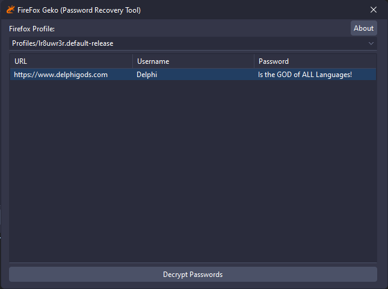

# 🔒 Delphi Password Decryptor for Firefox

  

A powerful yet minimalist Delphi application for decrypting saved passwords from Mozilla Firefox profiles.

## Features

* Automatically detects and lists available Firefox profiles.  
* Decrypts saved usernames and passwords from both JSON (`logins.json`) and SQLite (`signons.sqlite`) storage formats.  
* User-friendly interface with a profile selector and password list display.  
* Integration with Firefox's NSS (Network Security Services) library for secure decryption.  

## Quick Start

1. Clone the repository or download the latest release.  
2. Open the project in the Delphi IDE and compile it.  
3. Run the application and select a Firefox profile to decrypt saved credentials.  

## Technical Details

* **Built With:** Delphi and the UniDAC library for SQLite database access.  
* **Core Decryption:** Uses NSS functions (`PK11SDR_Decrypt`, `PK11_GetInternalKeySlot`) to decrypt Base64-encoded passwords securely.  
* **Firefox Profile Management:** Reads `profiles.ini` to automatically list user profiles.  
* **Cross-Version Compatibility:** Supports 32-bit and 64-bit Firefox installations.  

## How It Works

1. Reads saved login data from Firefox's `logins.json` or `signons.sqlite` file.  
2. Loads and initializes NSS from the Firefox installation directory.  
3. Decrypts saved passwords and displays them in a list view.  

## Requirements

* Windows operating system.  
* Firefox installed with saved login data.  
* Delphi IDE for compilation (tested with modern versions).  

## Limitations

* Requires access to the target Firefox profile directory.  
* Windows-only compatibility due to NSS and Delphi dependencies.  
* Does not handle profiles with custom master passwords.  

## Contributing

We welcome contributions! You can:  
* Report bugs.  
* Suggest features.  
* Submit pull requests for enhancements.  

## Support

Need help? Open an issue in this repository!  

## License

Free to use and modify for personal or educational projects.  

Made with ❤️ using Delphi

